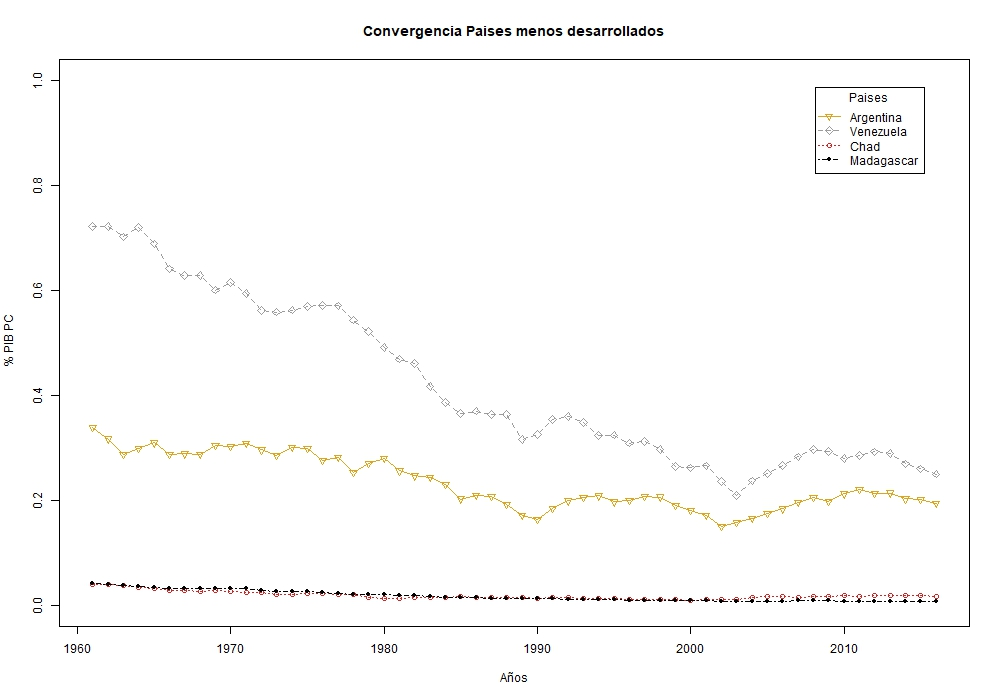

## Ejercicio (Logit-Probit)

Primero cargamos la base de datos

    load("logitprobit.Rdata")
    
Para este ejercicio vamos a seleccionar 5 variables de la base de datos de la gran encuesta integrada de hogares (GEIH) del año 2015 y colocarles unos nombres mas concretos

    datos1<-datos[,c("P7170s1","Inglabo","P6040","P6430","P6880")]
    colnames(datos1)<-c("satisfecho","ingreso","edad","forma","donde")
    dim(datos1); head(datos1)

Breve descripción de las variables

    P7170s1: ¿Está satisfecho con su trabajo actual?
    Inglabo: Ingresos laborales
    P6O40: ¿Cuantos años cumplidos tiene?
    P6430: En este trabajo es:
    P6880:Donde realiza principalmente su trabajo:
    
1. 787044     
2.  5

|Satisfecho|Sexo| Ingreso|Forma |Donde | 
|--|--|--|--|--|
|1 |1500000 |41 |2| 7|
|NA|NA|42|NA|NA|
|NA|NA|9|NA|NA|
|NA|NA|8|NA|NA|
|1|460000|26|4|4|
|NA|NA|29|NA|NA|

Los _NA's_ son valores perdidos por lo que es necesario determinar que hacer con los datos. Al tratarse de la Encuesta Integrada de Hogares, esos datos corresponden a las personas que no están en edad de trabajar por lo que lo mejor es omitirlos:

    datos2 <- na.omit(datos1);dim(datos2); head(datos2)

1. 317096    

2. 5


|Satisfecho  |Sexo  |Ingreso |Forma |Donde | 
|--|--|--|--|--|
| 1|1500000  |41 |2 |7 | 
| 1|460000 |26 |4 |4 |
| 2|600000 |36 |4 |4 |
| 2|280000 |37 |4 |2 |
| 1|100000 |71 |4 |6 |
|1 |616000 |21 |1 |7 |


Algunas variables seleccionadas son categóricas por lo que necesitamos convertirlas adecuadamente en factores, también, requerimos identificar correctamente cada categoría:

    datos2$satisfecho<-replace(datos2$satisfecho,datos2$satisfecho==2,0)
    datos2$satisfaccion<-datos2$satisfecho
    datos2$satisfaccion<-replace(datos2$satisfaccion,datos2$satisfaccion==1,
    "Satisfecho")
    datos2$satisfaccion<-replace(datos2$satisfaccion,datos2$satisfaccion==0,
    "Insatisfecho")
    datos2$satisfaccion<-factor(datos2$satisfaccion)
    summary(datos2$satisfaccion)

**Insatisfecho**
*51668*

**Satisfecho**
*265428*


En relación a las variables categoricas forma y donde, vamos a relizar unas agrupaciones 

```
 table(datos2$forma)

     1      2      3      4      5      6      7      8      9 
123919  16346  12455 148342  10782     94      9   4839    310 
 
 table(datos2$donde)

     1      2      3      4      5      6      7      8      9     10     11 
 36134  34719    815  23309  16791  19121 147079  25370  12783    707    268 
```


  

    datos2$forma<-replace(datos2$forma,datos2$forma==1,"empleado")
    datos2$forma<-replace(datos2$forma,datos2$forma==2,"empleado")
    datos2$forma<-replace(datos2$forma,datos2$forma==3,"empleado")
    datos2$forma<-replace(datos2$forma,datos2$forma==4,"cuenta propia")
    datos2$forma<-replace(datos2$forma,datos2$forma==5,"cuenta propia")
    datos2$forma<-replace(datos2$forma,datos2$forma==6,"otros")
    datos2$forma<-replace(datos2$forma,datos2$forma==7,"otros")
    datos2$forma<-replace(datos2$forma,datos2$forma==8,"pensionado")
    datos2$forma<-replace(datos2$forma,datos2$forma==9,"otros")
    datos2$forma<-factor(datos2$forma)
    summary(datos2$forma)
**Cuenta propia**

*159124*

**Empleado**

*152720*

**Otros**

*413*

**Pensionado**

*4839*


    datos2$donde<-replace(datos2$donde,datos2$donde==1, "vivienda")
    datos2$donde<-replace(datos2$donde,datos2$donde==2, "vivienda")
    datos2$donde<-replace(datos2$donde,datos2$donde==3, "ambulante")
    datos2$donde<-replace(datos2$donde,datos2$donde==4, "ambulante")
    datos2$donde<-replace(datos2$donde,datos2$donde==5, "ambulante")
    datos2$donde<-replace(datos2$donde,datos2$donde==6, "ambulante")
    datos2$donde<-replace(datos2$donde,datos2$donde==7, "local")
    datos2$donde<-replace(datos2$donde,datos2$donde==8, "rural")
    datos2$donde<-replace(datos2$donde,datos2$donde==9, "exteriores")
    datos2$donde<-replace(datos2$donde,datos2$donde==10, "exteriores")
    datos2$donde<-replace(datos2$donde,datos2$donde==11, "exteriores")
    datos2$donde<-factor(datos2$donde)
    summary(datos2$donde)

**Ambulante**

*60036*

**Exteriores**

*13758*

**Local**

*147079*

**Rural**

*25370*

**Vivienda**

*70853*


A continuación vamos a generar una variable categorica para la edad que posteriormente usaremos solo para propositos de estadistica descriptiva

    edades=vector()
    edades[datos2$edad<28]="Jovenes"
    edades[datos2$edad>=28 & datos2$edad<50]="Adultos"
    edades[datos2$edad>=50]="Adultos Mayores"
    datos2$edades=as.factor(edades)

**Adultos**

*160779*

**Adultos Mayores**

*81615*

**Jovenes**

*74702*

```
summary(datos2)
```


```
 satisfecho        ingreso               edad                 forma       
 Min.   :0.0000   Min.   :        0   Min.   :10.00   cuenta propia:159124  
 1st Qu.:1.0000   1st Qu.:   360000   1st Qu.:28.00   empleado     :152720  
 Median :1.0000   Median :   644350   Median :38.00   otros        :   413  
 Mean   :0.8371   Mean   :   877375   Mean   :39.57   pensionado   :  4839  
 3rd Qu.:1.0000   3rd Qu.:   980000   3rd Qu.:50.00                         
 Max.   :1.0000   Max.   :100000000   Max.   :98.00                         
        donde              satisfaccion                edades      
 ambulante : 60036   Insatisfecho: 51668   Adultos        :160779  
 exteriores: 13758   Satisfecho  :265428   Adultos Mayores: 81615  
 local     :147079                         Jovenes        : 74702  
 rural     : 25370                                                 
 vivienda  : 70853                                                 
                                                  
```


Ahora se realizara un analisis descriptivo de las variables a través de tablas de contingencia

    with(datos2, addmargins(prop.table( table(edades,satisfaccion))*100))


|  | Insatisfecho |Satisfecho | Sum|
|--|--|--|--|
| Adultos |  8.253967 |42.449605  |50.703572 |
| Adultos Mayores| 3.120191   |22.618071 | 25.738262 |
| Jovenes| 4.919961   | 18.638204  |23.558165 | 
|sum|16.294119 |83.705881 |100.000000 | 


    with(datos2, addmargins(prop.table( table(forma,satisfaccion))*100))


|  |Insatisfecho  |Satisfecho  |Sum |
|--|--|--|--|
|Cuenta propia  |9.53212907  |40.64951939  |50.18164846  |
|Empleado  |6.48289477  |41.67917602  |48.16207079  |
|Otros  | 0.03185155  |0.09839292  |0.13024447  |
|Pensionado|0.24724374|1.27879254   |1.52603628  |
|Sum    |16.29411913 |83.70588087   |100.00000000| 


    with(datos2, addmargins(prop.table( table(donde,satisfaccion))*100))


|  |Insatisfecho  |Satisfecho |Sum |
|--|--|--|--|
|Ambulante  |4.094974|14.838093 |18.933068 |
|Exteriores |0.787774  |3.550975 |4.338749  |
|Local |5.820950 |40.562164 |46.383114 |
|Rural |1.420390 |6.580342 |8.000732 |
|Vivienda | 4.170031 |18.174307 |22.344337 |
|Sum |16.294119 |83.705881 |100.000000 | 


Para complementar este análisis graficaremos

``` bash
    with(datos2,barplot(prop.table(table(satisfaccion,edades))*100,beside=T,
    main="Satisfacción según la clasificación de edad",xlab="Clasificación",
    ylab="Porcentaje",col=c("red","grey")))
    legend("topright",c("Insatisfecho","satisfecho"),cex=1.6,col=c("red","grey"),
    lty=1:1)

```



a ver
