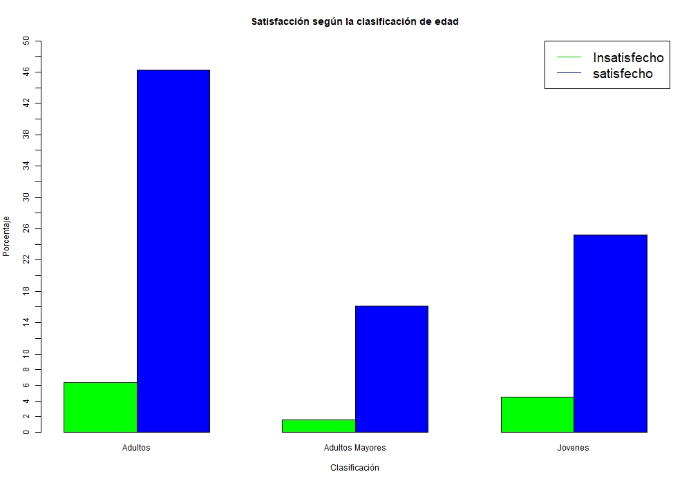

## Ejercicio (Logit-Probit)

Primero cargamos la base de datos

    load("logitprobit.Rdata")
    
Para este ejercicio vamos a seleccionar 5 variables de la base de datos de la gran encuesta integrada de hogares (GEIH) del año 2015 y colocarles unos nombres mas concretos

```bash

    datos1<-datos[,c("P7170s1","Inglabo","P6040","P6430","P6880")]
    colnames(datos1)<-c("satisfecho","ingreso","edad","forma","donde")
    dim(datos1); head(datos1)

```

Breve descripción de las variables

```bash

    P7170s1: ¿Está satisfecho con su trabajo actual?
    Inglabo: Ingresos laborales
    P6O40: ¿Cuantos años cumplidos tiene?
    P6430: En este trabajo es:
    P6880:Donde realiza principalmente su trabajo:
   
   ```
   
1. 787044     
2.  5

|Satisfecho|Ingreso|Edad|Forma |Donde | 
|--|--|--|--|--|
|1 |1500000 |41 |2| 7|
|NA|NA|42|NA|NA|
|NA|NA|9|NA|NA|
|NA|NA|8|NA|NA|
|1|460000|26|4|4|
|NA|NA|29|NA|NA|

Los _NA's_ son valores perdidos por lo que es necesario determinar que hacer con los datos. Al tratarse de la Encuesta Integrada de Hogares, esos datos corresponden a las personas que no están en edad de trabajar por lo que lo mejor es omitirlos:

    datos2 <- na.omit(datos1);dim(datos2); head(datos2)

1. 317096    

2. 5


|Satisfecho  |Ingreso  |Edad |Forma |Donde | 
|--|--|--|--|--|
| 1|1500000  |41 |2 |7 | 
| 1|460000 |26 |4 |4 |
| 2|600000 |36 |4 |4 |
| 2|280000 |37 |4 |2 |
| 1|100000 |71 |4 |6 |
|1 |616000 |21 |1 |7 |


Algunas variables seleccionadas son categóricas por lo que necesitamos convertirlas adecuadamente en factores, también, requerimos identificar correctamente cada categoría:

```bash

    datos2$satisfecho<-replace(datos2$satisfecho,datos2$satisfecho==2,0)
    datos2$satisfaccion<-datos2$satisfecho
    datos2$satisfaccion<-replace(datos2$satisfaccion,datos2$satisfaccion==1,
    "Satisfecho")
    datos2$satisfaccion<-replace(datos2$satisfaccion,datos2$satisfaccion==0,
    "Insatisfecho")
    datos2$satisfaccion<-factor(datos2$satisfaccion)
    summary(datos2$satisfaccion)

```

**Insatisfecho**
*51668*

**Satisfecho**
*265428*


En relación a las variables categoricas forma y donde, vamos a relizar unas agrupaciones 

```
 table(datos2$forma)

     1      2      3      4      5      6      7      8      9 
123919  16346  12455 148342  10782     94      9   4839    310 
 
 table(datos2$donde)

     1      2      3      4      5      6      7      8      9     10     11 
 36134  34719    815  23309  16791  19121 147079  25370  12783    707    268 
```

```bash
  

    datos2$forma<-replace(datos2$forma,datos2$forma==1,"empleado")
    datos2$forma<-replace(datos2$forma,datos2$forma==2,"empleado")
    datos2$forma<-replace(datos2$forma,datos2$forma==3,"empleado")
    datos2$forma<-replace(datos2$forma,datos2$forma==4,"cuenta propia")
    datos2$forma<-replace(datos2$forma,datos2$forma==5,"cuenta propia")
    datos2$forma<-replace(datos2$forma,datos2$forma==6,"otros")
    datos2$forma<-replace(datos2$forma,datos2$forma==7,"otros")
    datos2$forma<-replace(datos2$forma,datos2$forma==8,"pensionado")
    datos2$forma<-replace(datos2$forma,datos2$forma==9,"otros")
    datos2$forma<-factor(datos2$forma)
    summary(datos2$forma)
    
```
    
**Cuenta propia**

*159124*

**Empleado**

*152720*

**Otros**

*413*

**Pensionado**

*4839*

```bash

    datos2$donde<-replace(datos2$donde,datos2$donde==1, "vivienda")
    datos2$donde<-replace(datos2$donde,datos2$donde==2, "vivienda")
    datos2$donde<-replace(datos2$donde,datos2$donde==3, "ambulante")
    datos2$donde<-replace(datos2$donde,datos2$donde==4, "ambulante")
    datos2$donde<-replace(datos2$donde,datos2$donde==5, "ambulante")
    datos2$donde<-replace(datos2$donde,datos2$donde==6, "ambulante")
    datos2$donde<-replace(datos2$donde,datos2$donde==7, "local")
    datos2$donde<-replace(datos2$donde,datos2$donde==8, "rural")
    datos2$donde<-replace(datos2$donde,datos2$donde==9, "exteriores")
    datos2$donde<-replace(datos2$donde,datos2$donde==10, "exteriores")
    datos2$donde<-replace(datos2$donde,datos2$donde==11, "exteriores")
    datos2$donde<-factor(datos2$donde)
    summary(datos2$donde)

```

**Ambulante**

*60036*

**Exteriores**

*13758*

**Local**

*147079*

**Rural**

*25370*

**Vivienda**

*70853*


A continuación vamos a generar una variable categorica para la edad que posteriormente usaremos solo para propositos de estadistica descriptiva

```bash

    edades=vector()
    edades[datos2$edad<28]="Jovenes"
    edades[datos2$edad>=28 & datos2$edad<50]="Adultos"
    edades[datos2$edad>=50]="Adultos Mayores"
    datos2$edades=as.factor(edades)

```

**Adultos**

*160779*

**Adultos Mayores**

*81615*

**Jovenes**

*74702*

```bash
summary(datos2)
```


```
 satisfecho        ingreso               edad                 forma       
 Min.   :0.0000   Min.   :        0   Min.   :10.00   cuenta propia:159124  
 1st Qu.:1.0000   1st Qu.:   360000   1st Qu.:28.00   empleado     :152720  
 Median :1.0000   Median :   644350   Median :38.00   otros        :   413  
 Mean   :0.8371   Mean   :   877375   Mean   :39.57   pensionado   :  4839  
 3rd Qu.:1.0000   3rd Qu.:   980000   3rd Qu.:50.00                         
 Max.   :1.0000   Max.   :100000000   Max.   :98.00                         
        donde              satisfaccion                edades      
 ambulante : 60036   Insatisfecho: 51668   Adultos        :160779  
 exteriores: 13758   Satisfecho  :265428   Adultos Mayores: 81615  
 local     :147079                         Jovenes        : 74702  
 rural     : 25370                                                 
 vivienda  : 70853                                                 
                                                  
```


Ahora se realizara un analisis descriptivo de las variables a través de tablas de contingencia

    with(datos2, addmargins(prop.table( table(edades,satisfaccion))*100))


|  | Insatisfecho |Satisfecho | Sum|
|--|--|--|--|
| Adultos |  8.253967 |42.449605  |50.703572 |
| Adultos Mayores| 3.120191   |22.618071 | 25.738262 |
| Jovenes| 4.919961   | 18.638204  |23.558165 | 
|sum|16.294119 |83.705881 |100.000000 | 


    with(datos2, addmargins(prop.table( table(forma,satisfaccion))*100))


|  |Insatisfecho  |Satisfecho  |Sum |
|--|--|--|--|
|Cuenta propia  |9.53212907  |40.64951939  |50.18164846  |
|Empleado  |6.48289477  |41.67917602  |48.16207079  |
|Otros  | 0.03185155  |0.09839292  |0.13024447  |
|Pensionado|0.24724374|1.27879254   |1.52603628  |
|Sum    |16.29411913 |83.70588087   |100.00000000| 


    with(datos2, addmargins(prop.table( table(donde,satisfaccion))*100))


|  |Insatisfecho  |Satisfecho |Sum |
|--|--|--|--|
|Ambulante  |4.094974|14.838093 |18.933068 |
|Exteriores |0.787774  |3.550975 |4.338749  |
|Local |5.820950 |40.562164 |46.383114 |
|Rural |1.420390 |6.580342 |8.000732 |
|Vivienda | 4.170031 |18.174307 |22.344337 |
|Sum |16.294119 |83.705881 |100.000000 | 


Para complementar este análisis graficaremos

``` bash
    with(datos2,barplot(prop.table(table(satisfaccion,edades))*100,beside=T,
    main="Satisfacción según la clasificación de edad",xlab="Clasificación",
    ylab="Porcentaje",col=c("red","grey")))
    legend("topright",c("Insatisfecho","satisfecho"),cex=1.6,col=c("red","grey"),
    lty=1:1)

```




``` bash

    with(datos2,barplot(prop.table(table(satisfaccion,forma))*100,beside=T,
     main="Satisfacción según el tipo de trabajo",xlab="Clasificación",
     ylab="Porcentaje",col=c("red","grey")))

    legend("topright",c("Insatisfecho","satisfecho"),cex=1.6,fill=c("red","grey"),
    lty=1:1)

```


``` bash

    with(datos2,barplot(prop.table(table(satisfaccion,donde))*100,beside=T,
    main="Satisfacción según el lugar de trabajo",xlab="Clasificación",
    ylab="Porcentaje",col=c("red","grey")))

    legend("topright",c("Insatisfecho","satisfecho"),cex=1.0,fill=c("red","grey"),
    lty=1:1)

```


Una mirada a las variables cuantitativas

```bash

    with(datos2,hist(ingreso*1e-6, main = "Ingreso (en Millones)", xlab="", freq=F,
    col=c("grey")))

```


Grafica de densidad de Kernel

```bash

    par(mfrow=c(2,1))
    d <- density(datos2$edad)
    plot(d)
    
    d <- density(datos2$edad)
    plot(d, main=" Densidad de la edad")
    polygon(d, col="grey", border="red")
    rug(datos2$edad, col="brown")
    par(mfrow=c(1,1))
```


ahora veremos las mediadas de dispersión


```bash

    stats <- function(x){
    x <- x
    m <- mean(x)
    n <- length(x)
    s <- sd(x)
    skew <- sum((x-m)^3/s^3)/n
    kurt <- sum((x-m)^4/s^4)/n - 3
    return(c(tamaño=n, media=m, "desviación estándar"=s, simetría=skew,
    kurtosis=kurt))}
    
    sapply(datos2, stats)
```

```bash

                     satisfecho      ingreso          edad        forma
tamaño               3.170960e+05 3.170960e+05  3.170960e+05 3.170960e+05
media                8.370588e-01 8.773750e+05  3.957301e+01           NA
desviación estándar  3.693126e-01 1.221827e+06  1.401222e+01 5.858906e-01
simetría            -1.825325e+00 1.570259e+01  4.239537e-01           NA
kurtosis             1.331815e+00 6.794995e+02 -5.010338e-01           NA
                          donde satisfaccion       edades
tamaño              3.17096e+05 3.170960e+05 3.170960e+05
media                        NA           NA           NA
desviación estándar 1.32797e+00 3.693126e-01 8.178827e-01
simetría                     NA           NA           NA
kurtosis                     NA           NA           NA
There were 16 warnings (use warnings() to see them)

```

veamos en detalle las variables que nos interesan


|  | ingreso | edad |
|--|--|--|
|tamaño  |317096|317096  |
|Min. |0|10 |
|1 st Qu . |360000 |28.00 |
|Mediana|644350 |38.00  |
|media   |877375 |39.573|
|3rd Qu.|980000 |50.00|
|Max. |100000000 |98.00 |
|desviación estándar |1221827 |14.012 |
|simetría |1.570259e+01 |4.239537e-01  | 
|kurtosis  |6.794995e+02 |-5.010338e-01 | 


----------

construcción de los modelos

    # Modelo
    logit <- glm(satisfecho ~ ingreso + edad + forma+ 
          donde, data = datos2, family = "binomial")
          summary(logit)

```bash

Warning message:
glm.fit: fitted probabilities numerically 0 or 1 occurred 

Call:
glm(formula = satisfecho ~ ingreso + edad + forma + donde, family = "binomial", 
    data = datos2)

Deviance Residuals: 
    Min       1Q   Median       3Q      Max  
-7.3874   0.3548   0.5419   0.6413   1.1182  

Coefficients:
                  Estimate Std. Error z value Pr(>|z|)    
(Intercept)     -7.661e-02  1.881e-02  -4.073 4.64e-05 ***
ingreso          8.102e-07  1.175e-08  68.940  < 2e-16 ***
edad             2.012e-02  3.689e-04  54.540  < 2e-16 ***
formaempleado    2.052e-01  1.186e-02  17.305  < 2e-16 ***
formaotros       1.038e-01  1.161e-01   0.894    0.371    
formapensionado  1.955e-01  4.343e-02   4.502 6.75e-06 ***
dondeexteriores  1.078e-01  2.491e-02   4.328 1.51e-05 ***
dondelocal       4.286e-01  1.411e-02  30.369  < 2e-16 ***
donderural       3.273e-01  2.110e-02  15.509  < 2e-16 ***
dondevivienda    3.062e-01  1.426e-02  21.470  < 2e-16 ***
---
Signif. codes:  0 ‘***’ 0.001 ‘**’ 0.01 ‘*’ 0.05 ‘.’ 0.1 ‘ ’ 1

(Dispersion parameter for binomial family taken to be 1)

    Null deviance: 281908  on 317095  degrees of freedom
Residual deviance: 267224  on 317086  degrees of freedom
AIC: 267244

Number of Fisher Scoring iterations: 6

```

    probit <- glm(satisfecho ~ ingreso + edad + forma+ 
           donde, data = datos2, family = binomial(link = "probit"))
           summary(probit)
```bash

Warning message:
glm.fit: fitted probabilities numerically 0 or 1 occurred 

Call:
glm(formula = satisfecho ~ ingreso + edad + forma + donde, family = 
binomial(link = "probit"), data = datos2)

Deviance Residuals: 
    Min       1Q   Median       3Q      Max  
-8.4904   0.3778   0.5480   0.6432   1.0515  

Coefficients:
                 Estimate Std. Error z value Pr(>|z|)    
(Intercept)     6.843e-02  1.065e-02   6.428 1.29e-10 ***
ingreso         3.472e-07  5.541e-09  62.657  < 2e-16 ***
edad            1.145e-02  2.053e-04  55.771  < 2e-16 ***
formaempleado   1.341e-01  6.496e-03  20.646  < 2e-16 ***
formaotros      1.887e-02  6.797e-02   0.278    0.781    
formapensionado 1.243e-01  2.410e-02   5.157 2.51e-07 ***
dondeexteriores 7.144e-02  1.409e-02   5.071 3.96e-07 ***
dondelocal      2.444e-01  7.887e-03  30.994  < 2e-16 ***
donderural      1.658e-01  1.195e-02  13.878  < 2e-16 ***
dondevivienda   1.526e-01  8.120e-03  18.794  < 2e-16 ***
---
Signif. codes:  0 ‘***’ 0.001 ‘**’ 0.01 ‘*’ 0.05 ‘.’ 0.1 ‘ ’ 1

(Dispersion parameter for binomial family taken to be 1)

    Null deviance: 281908  on 317095  degrees of freedom
Residual deviance: 268315  on 317086  degrees of freedom
AIC: 268335

Number of Fisher Scoring iterations: 9

```

de donde debemos elegir con cual quedarnos 

    AIC(logit,probit)

|  | df   |AIC |
|--|--|--|
|logit  | 10   |267243.9 |
|probit | 10  |268335.3 | 

pocedemos con los test de independencia

    library(aod)
    
    wald.test(b = coef(logit), Sigma = vcov(logit), Terms = 4:5)# Para forma de
    trabajo= empleado y otros

```bash

Wald test:
----------

Chi-squared test:
X2 = 299.5, df = 2, P(> X2) = 0.0

```

 
    wald.test(b = coef(logit), Sigma = vcov(logit), Terms = 6)# Para forma de
    trabajo =pensionado

```bash

Wald test:
----------

Chi-squared test:
X2 = 20.3, df = 1, P(> X2) = 6.7e-06

```
    
    wald.test(b = coef(logit), Sigma = vcov(logit), Terms = 7:8) # Para lugar de
    trabajo= exteriores y local 

```bash

Wald test:
----------

Chi-squared test:
X2 = 965.4, df = 2, P(> X2) = 0.0

```
    
    wald.test(b = coef(logit), Sigma = vcov(logit), Terms = 9:10) # Para lugar de
    trabajo= rural y vivienda

```bash

Wald test:
----------

Chi-squared test:
X2 = 531.1, df = 2, P(> X2) = 0.0

```
summary(logit)

```bash

Call:
glm(formula = satisfecho ~ ingreso + edad + forma + donde, family = "binomial", 
    data = datos2)

Deviance Residuals: 
    Min       1Q   Median       3Q      Max  
-7.3874   0.3548   0.5419   0.6413   1.1182  

Coefficients:
                  Estimate Std. Error z value Pr(>|z|)    
(Intercept)     -7.661e-02  1.881e-02  -4.073 4.64e-05 ***
ingreso          8.102e-07  1.175e-08  68.940  < 2e-16 ***
edad             2.012e-02  3.689e-04  54.540  < 2e-16 ***
formaempleado    2.052e-01  1.186e-02  17.305  < 2e-16 ***
formaotros       1.038e-01  1.161e-01   0.894    0.371    
formapensionado  1.955e-01  4.343e-02   4.502 6.75e-06 ***
dondeexteriores  1.078e-01  2.491e-02   4.328 1.51e-05 ***
dondelocal       4.286e-01  1.411e-02  30.369  < 2e-16 ***
donderural       3.273e-01  2.110e-02  15.509  < 2e-16 ***
dondevivienda    3.062e-01  1.426e-02  21.470  < 2e-16 ***
---
Signif. codes:  0 ‘***’ 0.001 ‘**’ 0.01 ‘*’ 0.05 ‘.’ 0.1 ‘ ’ 1

(Dispersion parameter for binomial family taken to be 1)

    Null deviance: 281908  on 317095  degrees of freedom
Residual deviance: 267224  on 317086  degrees of freedom
AIC: 267244

Number of Fisher Scoring iterations: 6

```

    l <- cbind(0, 0, 0, 1, -1, 0, 0, 0,0,0)
    wald.test(b = coef(logit), Sigma = vcov(logit), L = l)

```bash

Wald test:
----------

Chi-squared test:
X2 = 0.76, df = 1, P(> X2) = 0.38

```


Estimaciones con nuevas observaciones


```bash

    newdatap1 <- data.frame(ingreso = rep(seq(from = min(datos2$ingreso),
    to = max(datos2$ingreso), length.out =150),4*5),
    edad = rep(seq(from = min(datos2$edad),
    to = max(datos2$edad), length.out =150), 4*5),
    forma= rep(rep(c("empleado","cuenta propia","otros","pensionado"), each =150),
    5),donde= rep(rep(c("vivienda","ambulante", "local","rural","exteriores"),
    each =150), 4))
    
    head(newdatap1)
    
```

```bash

    newdatap1[, c("p", "se")] <- predict(logit, newdatap1, type = "response",
    se.fit = TRUE)[-3]
    
    head(newdatap1)

```


|ingreso   |  edad   | forma |donde  | p |se |
|--|--|--|--|--|--|
|0.0  |10.00000  |empleado |vivienda  |0.6538552 |0.003924823 | 
|671140.9 |10.59060 |empleado |vivienda  |0.7670344 |0.002961441 |
|1342281.9 |11.18121 |empleado |vivienda  |0.8516060 |0.002439339 | 
|2013422.8 |11.77181 |empleado |vivienda  |0.9091141 |0.002014648 |
|2684563.8 |12.36242 |empleado |vivienda  |0.9457552 |0.001573271 |
|3355704.7 |12.95302 |empleado |vivienda  |0.9681420  |0.001158307 |


```bash

    ggplot(newdatap1, aes(x = ingreso, y = p, colour =forma)) +
    geom_line() + facet_wrap(~donde)

```


